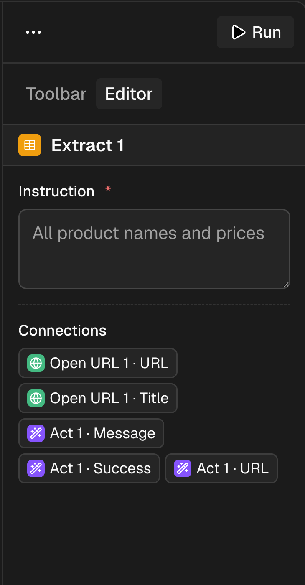
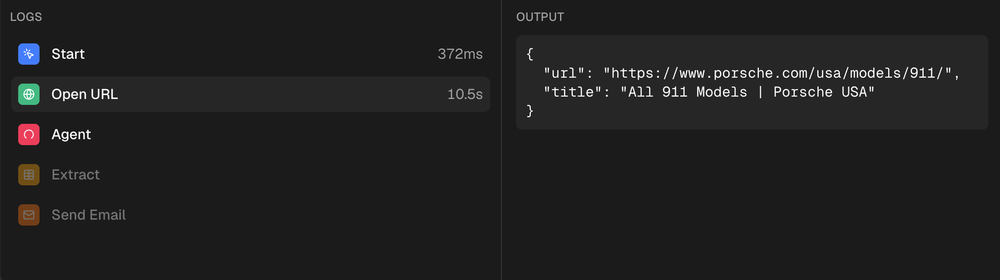

# Browser Automation

<p align="center">
  <strong>Design, run, and inspect browser automation workflows visually.</strong>
</p>

<p align="center">
  <a href="#what-it-does">What it does</a> &bull;
  <a href="#quick-start">Quick start</a> &bull;
  <a href="#workflow-nodes">Nodes</a> &bull;
  <a href="#architecture">Architecture</a> &bull;
  <a href="#scripts">Scripts</a>
</p>

<p align="center">
  
  
  
  
</p>


## What it does

Browser Automation is a collaborative, organization-aware workflow editor for browser tasks. Build a graph of natural-language steps, run it in a managed browser session, follow progress node by node, and review the resulting browser replay.

- Compose workflows on a drag-and-drop React Flow canvas.
- Collaborate live in a shared Liveblocks room per workflow.
- Run graphs in dependency order with Trigger.dev and inspect per-step status, output, duration, and failures.
- Automate browsing with Browserbase + Stagehand, then view session recordings.
- Persist workflows in Neon Postgres through Drizzle ORM.
- Scope workflows, rooms, and data to Clerk organizations.
- Gate Agent execution and session replay behind a Clerk Pro plan.

## Product tour

| Visual editor | Run console |
| :---: | :---: |
|  |  |

The editor includes a node palette, an inspector for step configuration, upstream-output interpolation, and a live run console. Workflows are validated before they are saved or run: each graph needs exactly one **Start** node, connected steps, and no cycles.

## Workflow nodes

| Node | Purpose | Output examples |
| --- | --- | --- |
| **Start** | Defines the single workflow trigger. | — |
| **Open URL** | Opens a URL in the shared browser session. | `url`, `title` |
| **Act** | Performs a natural-language browser action. | `success`, `message`, `url` |
| **Extract** | Extracts information from the current page. | `extraction` |
| **Observe** | Finds matching elements on the current page. | `matches` |
| **Agent** | Lets Stagehand complete a natural-language goal. _Pro plan required._ | `success`, `message`, `completed` |
| **Send Email** | Sends an HTML email through Resend. | `id` |

Later steps can use data from earlier ones with placeholders such as `{{ node-id.title }}`. Browser-oriented nodes share one lazily created Browserbase session, so the whole workflow is recorded as one replay.

## Architecture

```text
Clerk organization
        │
        ├── Next.js application ── React Flow + Liveblocks collaboration
        │          │
        │          └── Drizzle ORM ── Neon Postgres (workflow graph)
        │
        └── Trigger.dev run ── Browserbase + Stagehand ── browser session/replay
                            └── Resend ── email delivery
```

Sentry is initialized for both the Next.js app and background task runtime, providing error reporting and run diagnostics.

